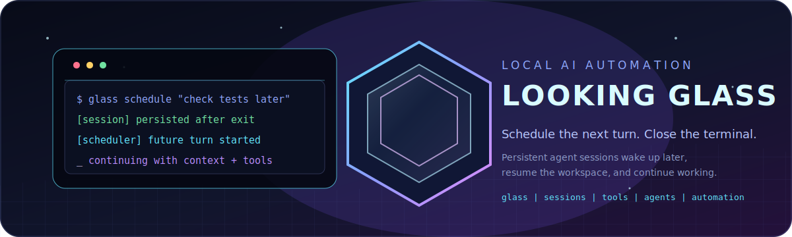

# Looking Glass



Looking Glass is an open-source local AI coding CLI for persistent, automatable sessions. It combines interactive terminal chat and one-shot prompts with workspace tools, configurable OpenAI-compatible gateways, durable SQLite state, and a scheduler for future model turns.

## Persistent Sessions and Scheduled Turns

The key idea is **a session is more than a chat window**. A persistent session can survive after the terminal closes. The scheduler can later reopen the original workspace and trigger another AI turn inside that same session, retaining its:

- Conversation, tool history, response continuity, and compaction checkpoints.
- Workspace, provider, primary model, reasoning settings, and persistence state.
- Approval mode, remembered approvals, worker-agent configuration, and schedules.
- Scheduler results, inbox records, and durable tool-output artifacts.

Scheduled prompts are not separate stateless jobs or fresh chats. Future turns can inspect files and logs that changed in the meantime, run tests or other commands, modify code, and write their results back into the session. This enables workflows such as:

- Start a deployment or long-running task, then schedule the same session to check the result.
- Follow up on test output and fix failures automatically.
- Run recurring project reviews that read the current codebase, execute tests, and report or resolve issues.
- Continue debugging after external processes produce new logs or artifacts.
- Keep a session working through scheduled turns while the interactive terminal is closed.
- Combine exact scheduled shell commands with context-aware AI follow-ups.

The main model and worker-agent model are configured independently, including separate reasoning levels. A stronger model can coordinate the task while faster or cheaper models handle parallel discovery, implementation, or review work.

## What It Provides

- **Interactive TUI and one-shot CLI prompts** for complete day-to-day development work.
- **Workspace tools** for reading, searching, patching, and bounded Bash execution.
- **Persistent approval modes** for interactive and automated turns, including remembered approvals.
- **Scheduled AI prompts, reminders, and deterministic shell commands.**
- **Concurrent worker agents** with independently selected models and reasoning settings.
- **OpenAI-compatible local or hosted gateways**, including LM Studio and codex-lb.
- **SQLite-backed sessions, scheduler state, and artifacts** with context recovery and compaction.
- **A user-level systemd scheduler** that runs independently of the interactive terminal.

Looking Glass is designed for one local operator. It is not a hosted service, multi-user system, or replacement for operating-system isolation.

## Requirements

- Linux
- Node.js 22 or newer
- npm
- `ripgrep` (`rg`)
- A running LM Studio or other OpenAI-compatible server exposing a Responses API

For a local LM Studio setup, the gateway URL is:

```text
http://127.0.0.1:1234/v1
```

## Install from npm

On Linux with Node.js 22 or newer:

```bash
npm install --global @sigil0/looking-glass
glass --version
```

The package is Linux-only for now. Windows users can run it through WSL2.

## Install From Source

For development or to work from the source tree, clone the public repository:

```bash
git clone https://github.com/S1gil0/lookingglass.git
cd lookingglass
npm ci
npm run build
npm link
glass --version
```

You can run directly from TypeScript during development with `npm run dev`, but the installed `glass` command and scheduler service use the compiled `dist/` output.

## Configure a Gateway

Looking Glass expects an OpenAI-compatible Responses API and `/v1/models`. The optional API key is read from the environment variable named by `gateway.apiKeyEnv`:

```bash
export LM_STUDIO_API_KEY=replace-with-your-token
```

Configuration is loaded in this order:

```text
~/.config/looking-glass/config.jsonc
~/.config/looking-glass/config.json
<workspace>/.looking-glass.jsonc
<workspace>/.looking-glass.json
```

Set `LOOKING_GLASS_CONFIG` to use a different explicit JSON or JSONC file. Workspace settings are applied after global settings, so a project can select its own model, gateway, instructions, or safety defaults.

Example configuration:

```jsonc
{
  "gateway": {
    "provider": "lm-studio",
    "baseURL": "http://127.0.0.1:1234/v1",
    "apiKeyEnv": "LM_STUDIO_API_KEY",
    "timeoutMs": 600000
  },
  "model": "example-model",
  "reasoningEffort": "medium",
  "verbosity": "low",
  "fast": false,
  "tools": {
    "approval": "code",
    "shellTimeoutMs": 120000,
    "maxOutputBytes": 65536,
    "maxReadLines": 2000,
    "maxToolRounds": 1000
  },
  "scheduler": {
    "timezone": "UTC",
    "pollIntervalMs": 1000,
    "leaseMs": 20000,
    "maxConcurrentCommands": 2,
    "commandStartGraceMs": 60000,
    "commandTimeoutMs": 600000,
    "commandOutputBytes": 65536
  }
}
```

The default approval mode is `code`.

### LM Studio and OpenAI-Compatible Gateways

LM Studio is one local option, but Looking Glass works with any gateway that
exposes the OpenAI-compatible Responses API and `/v1/models`. This includes
`codex-lb` and compatible deployments of vLLM, LiteLLM, LocalAI, llama.cpp,
Ollama, or hosted OpenAI-compatible endpoints. The exact feature set depends
on the gateway's support for Responses API streaming, tools, and model
metadata.

If authentication is disabled, omit `apiKeyEnv` from the gateway configuration:

```bash
export LM_STUDIO_API_KEY=replace-with-your-token
```

```jsonc
{
  "gateway": {
    "provider": "lm-studio",
    "baseURL": "http://127.0.0.1:1234/v1",
    "apiKeyEnv": "LM_STUDIO_API_KEY"
  }
}
```

Inspect the configured model catalog and gateway health:

```bash
glass models
```

Use a provider-prefixed model ID to make an explicit provider selection:

```text
/model lm-studio:example-model
```

Changing provider or model rotates remote continuity and cache identity, then replays the durable local session history. Provider affinity is retained, so a provider does not change silently.

## CLI At A Glance

Run `glass help` for the built-in synopsis:

```text
glass                         Start the interactive chat
glass run [--yes] [--session ID] PROMPT
glass models                  List provider, model, context, and display name
glass sessions                List durable interactive sessions
glass sessions persist ID on|off
glass config                  Print paths, instruction files, and effective config
glass doctor                  Check SQLite, ripgrep, providers, and scheduler status
glass cron ...                Create and manage reminders, commands, and session prompts
```

### Start an Interactive Session

Run `glass` from the workspace you want the model to work in:

```bash
cd ~/src/my-project
glass
```

Bare `glass` starts a fresh session. It appears in session history only after its first message; exiting or switching away before then discards the empty draft. The top metadata line shows the active model, reasoning effort, context usage, agent state, approval mode, persistence state, and session title. The transcript and tool history are saved as you work.

### Run One Prompt

Use `glass run` when you want a single prompt from a script or a regular shell:

```bash
glass run "Inspect the project and summarize its current state"
glass run "Run the tests and explain any failures"
```

Use `--session` to continue an existing session instead of creating a new one:

```bash
glass run --session SESSION_ID "Continue the deployment investigation"
```

`glass run --yes` automatically approves normal interactive approvals for the one-shot process, but does not approve persistent or critical actions. For fully noninteractive work, use a session whose durable approval mode is `unrestricted`.

### Inspect the Local Installation

```bash
glass --help
glass --version
glass models
glass sessions
glass config
glass doctor
```

`glass config` is useful when a session is using an unexpected model or gateway. It prints the workspace, state database, loaded instruction files, truncation status, and effective configuration.

## Sessions: Durable Project Memory

A session is a durable work thread scoped to a workspace. It is the unit that connects conversation context, files, model settings, permissions, and schedules.

### Start, Resume, and Switch

```bash
glass                         # New interactive session in the current workspace
glass chat --session ID       # Resume an interactive session
glass run --session ID "..."  # Continue it with one prompt
```

Inside the TUI:

```text
/new
/sessions
/sessions SESSION_ID
```

Use `/new` for a separate task, even in the same folder. This keeps unrelated context from contaminating one another. Use `/sessions` when you want to browse titles, models, approval modes, persistence state, schedule counts, and last activity.

### What Persists

Looking Glass stores session events and tool state in SQLite. Depending on the provider, it also stores local replay material or response continuity identifiers. Context compaction creates durable checkpoints instead of deleting the session's identity.

The workspace is part of the session's operating context. Files are not copied into the database: the session continues to work against the same workspace on disk. If you schedule a prompt for a session, the scheduler opens that session in its workspace and sends the next model turn with the session's durable history.

This means a scheduled session can naturally follow a task such as:

1. Ask the model to scaffold a service.
2. Leave the workspace while tests or a deployment run.
3. Schedule the same session to inspect the result.
4. Let the scheduled turn read the files, see the prior conversation, run tools, and report or fix the next issue.

The model does not magically remember external changes that were never written to the workspace or session events. A scheduled prompt should explicitly ask it to inspect current files, logs, test results, or other durable inputs.

### Rename and Manage a Session

Use `/session` for the session menu. It can rename the session, manage persistence, inspect schedules, and review or revoke remembered approvals. Session deletion is permanent for the transcript, checkpoints, tool records, attached schedules, scheduler occurrences, inbox records, and approvals. Detached artifact files are retained.

## TUI Commands

Enter slash commands inside `glass`:

| Command | Purpose |
| --- | --- |
| `/new` | Create and switch to a new session |
| `/sessions [ID]` | Browse sessions or switch directly to an ID |
| `/session` | Open session management, rename, persistence, schedules, or approvals |
| `/persist [on\|off]` | Enable or disable persistence for this session |
| `/model [ID]` | Select a primary model; without an ID, open the model picker |
| `/reasoning [effort]` | Select primary model reasoning effort |
| `/agents [on\|off]` | Enable or disable delegation for this session |
| `/agentmodel [ID]` | Select the model used by leaf agents |
| `/agentreasoning [effort]` | Select leaf-agent reasoning effort |
| `/thinking [on\|off]` | Show or hide model-provided reasoning summaries |
| `/fast [on\|off]` | Toggle fast service when supported |
| `/compact` | Compact the current conversation context |
| `/permissions [review\|code\|unrestricted]` | Change durable approval mode |
| `/schedule ...` | Schedule an AI turn in this session |
| `/cron [session]` | Browse, run, pause, resume, resolve, or delete schedules |
| `/inbox` | Show unread scheduler records and mark them read |
| `/exit` | Exit the TUI |

The transcript supports mouse-wheel scrolling, `PageUp`, and `PageDown`. Dragging across text selects and copies it through OSC52 with a native clipboard fallback. `Ctrl+C` cancels the active turn or exits when no turn is running.

## The Main Automation Workflow

Scheduled session prompts are the feature to use when you want Looking Glass to continue a project by itself. A scheduled prompt is not a detached new chat. It is a future turn of an existing session.

### Schedule From Inside the Session

First make the session persistent:

```text
/persist on
```

Then schedule a one-shot follow-up:

```text
/schedule once 2026-07-20T12:00:00Z Inspect the current test results and fix any failures
```

Or schedule a recurring review using a five-field cron expression:

```text
/schedule cron "0 9 * * 1-5" Review project health, run the tests, and report anything requiring operator action
```

If you use `/schedule` before persistence is enabled, the TUI offers to enable it. Scheduled session prompts inherit the current session's workspace, conversation, model, agent settings, approval mode, and durable state.

### Schedule From the CLI

Use `glass cron prompt` with an existing session:

```bash
glass cron prompt --once 2026-07-20T12:00:00Z --session SESSION_ID "Inspect the current test results and fix any failures"
```

Recurring prompt:

```bash
glass cron prompt --cron "0 9 * * 1-5" --timezone UTC --session SESSION_ID "Review project health and report anything requiring operator action"
```

The target session must be persistent. Enable it from the TUI with `/persist on` or from the CLI:

```bash
glass sessions persist SESSION_ID on
```

### What Happens When It Runs

The scheduler daemon claims the occurrence and asks the selected session's model to process the prompt. The turn:

- Reopens the same session ID.
- Uses the same workspace on disk.
- Replays or anchors the existing conversation context.
- Retains the session's model, provider, reasoning, agents, and approval settings.
- Can read files changed since the previous turn.
- Can write files and run commands according to the session's durable permissions.
- Writes the response, tool calls, output, and outcome back to durable state.
- Appears in the scheduler inbox and session transcript.

Scheduled turns cannot wait for a human answer. In `review` and `code`, unremembered gated actions remain denied. In `unrestricted`, the session can execute available tools without confirmation. If a process is interrupted after a side effect may have occurred, the occurrence becomes unknown and must be explicitly resolved before a recurring job continues.

### Keep Scheduled Work Safe and Useful

Write prompts that describe the desired autonomous boundary:

```text
Review the latest test output. Read the changed files, run the focused tests, and fix only failures inside this workspace. Summarize every change and leave deployment untouched.
```

For recurring sessions, make the prompt idempotent and ask for current inspection rather than assuming the previous turn completed. Store important external inputs in files or logs that the session can read.

## Scheduler Job Types

Looking Glass supports three schedule types:

| Job | What it does | Best for |
| --- | --- | --- |
| `reminder` | Writes a durable inbox message | Human follow-ups and deadlines |
| `command` | Runs the exact stored Bash string | Deterministic tests, scripts, and maintenance |
| `session_prompt` | Runs one model turn in a persistent session | Context-aware project automation |

Create a reminder:

```bash
glass cron reminder --once 2026-07-20T12:00:00Z "Review the deployment dashboard"
glass cron reminder --cron "0 9 * * 1-5" --timezone UTC "Review the deployment dashboard"
```

Create a deterministic command. Pass the full shell command as one quoted argument so its exact text is preserved:

```bash
glass cron command --once 2026-07-20T12:00:00Z "npm test"
glass cron command --cron "0 2 * * *" --cwd . "./scripts/backup.sh"
```

Unlike `session_prompt`, a deterministic command does not use model context. It runs exactly the command stored in the job, with the configured timeout and output limit.

List and manage jobs:

```bash
glass cron list
glass cron inbox
glass cron inbox --all
glass cron status
glass cron pause JOB_ID
glass cron resume JOB_ID
glass cron run JOB_ID
glass cron resolve JOB_ID
glass cron delete JOB_ID
glass cron ack INBOX_ID
```

`run` queues one immediate occurrence. `resolve` acknowledges an unknown side-effect outcome so a blocked recurring job can continue. `ack` marks an inbox item as read.

## Install the Scheduler Service

The scheduler must be running for schedules to execute while the TUI is closed. Build first, then install the user-level systemd service:

```bash
npm run build
glass cron install
glass cron status
```

The service is installed at:

```text
~/.config/systemd/user/looking-glass-scheduler.service
```

It uses the current user's state database, takes one durable daemon lease, claims occurrences safely, fences stale workers after failure, and restarts on failure. The service does not delete scheduler state when uninstalled:

```bash
glass cron uninstall
```

Authenticated gateways used by scheduled prompts need their token available to the service. Keep it in a mode-`0600` environment file outside the repository:

```bash
install -d -m 700 ~/.config/looking-glass
printf '%s\n' 'LM_STUDIO_API_KEY=replace-with-your-token' > ~/.config/looking-glass/scheduler.env
chmod 600 ~/.config/looking-glass/scheduler.env
```

Exported environment variables take precedence. Never commit this file.

To run the daemon in the foreground for debugging:

```bash
glass cron daemon
```

## Agents

The main model can call `run_agents` with up to eight self-contained tasks and bounded concurrency. Agents are useful for independent discovery, disjoint implementation, newly discovered branches, or focused review after a change.

```text
/agentmodel lm-studio:example-model
/agentreasoning high
/agents on
```

Each worker gets a hidden child session with isolated conversation history, response continuity, and tool records. The parent transcript is not copied, so delegated prompts should include the objective, relevant files, constraints, validation command, and expected return format.

Workers share the filesystem with the parent. Keep concurrent tasks independent or assign disjoint files. Leaf agents cannot recursively spawn agents, create schedules, or ask the operator questions. They inherit the parent's approval mode and remembered approvals.

## Tools

The model can use these built-in tools:

| Tool | Function |
| --- | --- |
| `read` | Read files or bounded directory listings inside the workspace |
| `glob` | Find files with bounded `ripgrep` searches |
| `grep` | Search workspace text with bounded regular expressions |
| `apply_patch` | Apply atomic workspace patches |
| `bash` | Run bounded noninteractive Bash commands |
| `ask_user` | Ask the interactive operator a question |
| `run_agents` | Run isolated leaf-agent tasks concurrently |
| `schedule_create` | Create reminders, deterministic commands, or session prompts |
| `schedule_list` | List schedules and scoped scheduler inbox records |
| `schedule_manage` | Pause, resume, delete, run, resolve, or acknowledge schedules |

File tools are workspace-bound and symlink-aware. Bash disables startup profiles, bounds captured output, stores oversized results as artifacts, and terminates process groups on cancellation or timeout.

## Approval Modes

Approval mode is durable per session and applies to both interactive and scheduled model turns:

| Mode | Reads | Normal writes | Bash | Persistent actions | Critical actions |
| --- | --- | --- | --- | --- | --- |
| `review` | No prompt | Prompt | Prompt | Prompt | Prompt |
| `code` | No prompt | No prompt | Prompt | Prompt | Prompt |
| `unrestricted` | No prompt | No prompt | No prompt | No prompt | No prompt |

Change the mode inside the TUI:

```text
/permissions review
/permissions code
/permissions unrestricted
```

`unrestricted` is fully noninteractive. It does not ask for confirmation for destructive commands, access-critical changes, schedules, or uncertain reruns. Risk is still classified for logging and display, but does not gate execution.

In `code`, choose `Always approve` when a command family should be reusable. Bash approvals are scoped by the leading executable: approving `cat one.txt` authorizes later commands starting with `cat`, regardless of arguments, redirects, working directory, timeout, risk classification, or compound suffix. Other tools use their canonical action arguments. Remembered approvals apply to the session's main turns, agents, and scheduled turns.

Looking Glass is not a sandbox. The process has the operating-system permissions of the user who launched it. Use `review` for unfamiliar repositories and reserve `unrestricted` for trusted local work.

## State and Workspace Instructions

Default XDG locations:

| Data | Default path | Override |
| --- | --- | --- |
| Global config | `~/.config/looking-glass/` | `XDG_CONFIG_HOME` |
| SQLite state | `~/.local/share/looking-glass/state.db` | `LOOKING_GLASS_DB` |
| Artifacts | `~/.local/share/looking-glass/artifacts/` | `XDG_DATA_HOME` |
| Scheduler environment | `~/.config/looking-glass/scheduler.env` | fixed optional path |

State directories use mode `0700`. Large tool output is retained as a durable artifact and referenced from the model result. Do not commit the database, artifacts, credentials, `.env` files, or local configuration.

Looking Glass loads instruction files in this order:

1. `~/.config/looking-glass/AGENTS.md`
2. `<workspace>/AGENTS.md`
3. Paths listed in the `instructions` configuration array

Instruction files can describe project conventions and operational context, but cannot create approval records or override a session's durable permissions. Only an explicit interactive `Always approve` decision creates reusable authorization.

## Troubleshooting

Check the effective environment:

```bash
glass config
glass doctor
glass models
```

Common fixes:

- If the model list is empty, verify the gateway URL and API key environment variable.
- If a scheduled prompt does not run, verify the session is persistent and `glass cron status` shows an active daemon.
- If LM Studio schedules fail after the TUI exits, put the token in `~/.config/looking-glass/scheduler.env` with mode `0600`.
- If a recurring job is blocked, inspect `glass cron list`, review the unknown outcome, then run `glass cron resolve JOB_ID` deliberately.
- If a resumed session appears to have lost context, confirm you used `--session ID` and are looking at the same workspace and state database.
- After source changes, run `npm run build` before using the installed `glass` command or reinstalling the scheduler service.

## Development

```bash
npm ci
npm run typecheck
npm test
npm run build
npm run dev
npm pack --dry-run
```

The build output is ignored by Git. The public source repository is:

```text
https://github.com/S1gil0/lookingglass.git
```

## Repository Layout

```text
src/
  app.ts                 Application wiring and workspace discovery
  cli.ts                 CLI entry point and scheduler commands
  config.ts              Global/workspace configuration loading
  engine/                Conversation execution and context projection
  model/                OpenAI-compatible gateway client integrations
  scheduler/             Persistent jobs, leases, claims, runner, daemon
  storage/               SQLite sessions, events, and artifacts
  tools/                 Coding tools, schemas, approvals, and safety policy
  ui/                    TUI and stdio interfaces
test/                    Unit and integration coverage
looking-glass-title.svg  README title graphic
```
