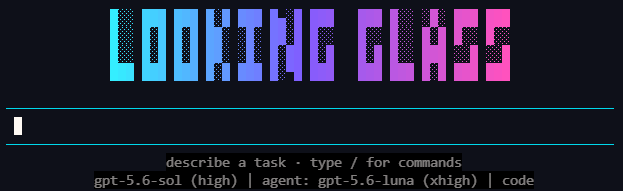
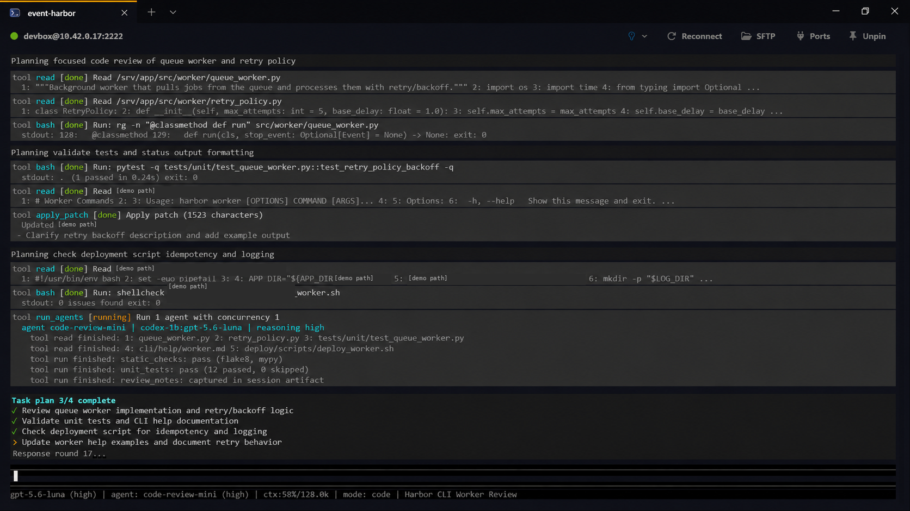
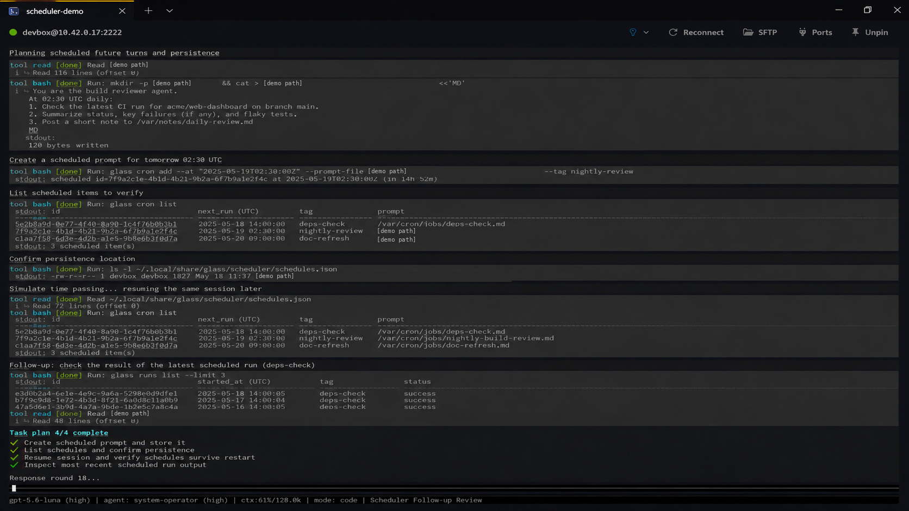
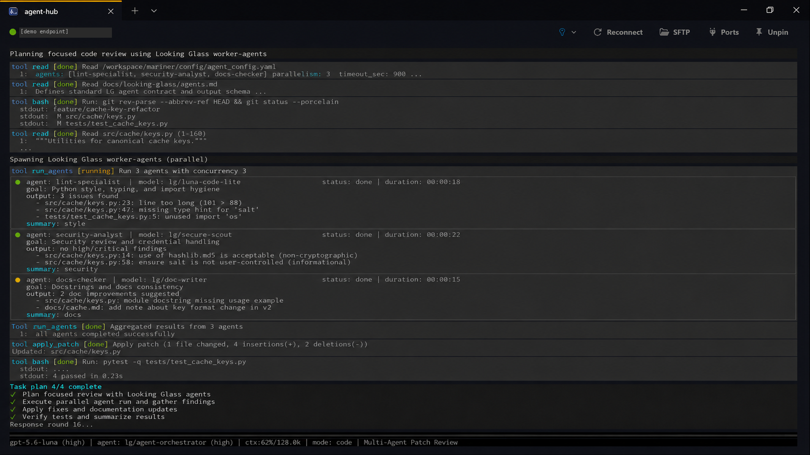

<p align="center">
  
</p>

Looking Glass is an open-source local AI coding CLI that lets one model orchestrate while concurrent worker agents use another—with an independent provider, model, and reasoning level for each role. A hosted model can coordinate the session while faster, cheaper, or local models handle parallel work, or the arrangement can be reversed.

It combines this multi-model orchestration with interactive terminal chat, complete development tools, persistent sessions, durable SQLite state, and a scheduler that can run future model turns after the terminal closes.

## Mix Models and Providers for Orchestration

The primary model owns the conversation, plans the work, and decides when to delegate. Worker agents run isolated discovery, implementation, or review tasks concurrently using their own shared agent configuration. The two roles can use the same gateway or completely different providers—for example, an OpenRouter model as coordinator and an LM Studio model for local worker agents.

Provider, model, and reasoning effort are selected independently for the primary and agent roles and stored with the session. Scheduled turns resume with the same choices. Configure them from the interactive model pickers or directly with slash commands:

```text
/model openrouter:<main-model-id>
/reasoning high
/agentmodel lm-studio:<worker-model-id>
/agentreasoning medium
/agents on
```

This makes it practical to reserve a stronger model for architecture and coordination while distributing parallel tasks to lower-latency or lower-cost models without leaving the session.

## Persistent Sessions and Scheduled Turns

The key idea is **a session is more than a chat window**. A persistent session can survive after the terminal closes. The scheduler can later reopen the original workspace and trigger another AI turn inside that same session, retaining its:

- Conversation, tool history, response continuity, and compaction checkpoints.
- Workspace, provider, primary model, reasoning settings, and persistence state.
- Approval mode, remembered approvals, worker-agent configuration, and schedules.
- Scheduler results, inbox records, and durable tool-output artifacts.

Scheduled prompts are not separate stateless jobs or fresh chats. Future turns can inspect files and logs that changed in the meantime, run tests or other commands, modify code, and write their results back into the session. This enables workflows such as:

- Start a deployment or long-running task, then schedule the same session to check the result.
- Follow up on test output and fix failures automatically.
- Run recurring project reviews that read the current codebase, execute tests, and report or resolve issues.
- Continue debugging after external processes produce new logs or artifacts.
- Keep a session working through scheduled turns while the interactive terminal is closed.
- Combine exact scheduled shell commands with context-aware AI follow-ups.

## What It Provides

- **Interactive TUI and one-shot CLI prompts** for complete day-to-day development work.
- **Workspace tools** for reading, searching, patching, and bounded host-shell execution.
- **Persistent approval modes** for interactive and automated turns, including remembered approvals.
- **Scheduled AI prompts, reminders, and deterministic shell commands.**
- **Concurrent worker agents** with independently selected models and reasoning settings.
- **Configured gateway providers** including codex-lb, LM Studio, OpenRouter, and a custom OpenAI-compatible profile.
- **SQLite-backed sessions, scheduler state, and artifacts** with context recovery and compaction.
- **A user-level scheduler** that runs independently of the interactive terminal (systemd on Linux and Task Scheduler on Windows).

Looking Glass is designed for one local operator. It is not a hosted service, multi-user system, or replacement for operating-system isolation.

## Screenshots

### Development workflow



### Persistent session automation



### Concurrent worker agents



## Requirements

- Linux or native Windows
- Node.js 22.19.0 or newer
- npm
- `ripgrep` (`rg` on Linux, `rg.exe` on Windows) on `PATH`
- A running LM Studio or other configured OpenAI-compatible gateway, or an OpenRouter account

The npm package targets Linux and native Windows (`win32`); macOS is not a
supported install target.

On Windows, use Windows Terminal (or another terminal that provides Windows
PowerShell, `powershell.exe`, on `PATH`). Looking Glass runs its shell tool and
scheduled commands through noninteractive Windows PowerShell; use PowerShell
syntax for those commands. Linux uses noninteractive Bash. Windows support is
covered by the GitHub Actions matrix; no additional local-platform validation
is implied here.

For a local LM Studio setup, the gateway URL is:

```text
http://127.0.0.1:1234/v1
```

## Install from npm

On Linux or native Windows with Node.js 22.19.0 or newer:

```text
npm install --global @sigil0/looking-glass
glass --version
```

The same commands run natively from PowerShell in Windows Terminal:

```powershell
npm install --global @sigil0/looking-glass
glass --version
```

## Install From Source

For development or to work from the source tree, clone the public repository:

```text
git clone https://github.com/S1gil0/lookingglass.git
cd lookingglass
npm ci
npm run build
npm link
glass --version
```

You can run directly from TypeScript during development with `npm run dev`, but the installed `glass` command and scheduler service use the compiled `dist/` output.

## Configure a Gateway

Looking Glass supports the built-in codex-lb and LM Studio Responses profiles, OpenRouter's Chat Completions profile, and a custom OpenAI-compatible gateway profile. The optional API key is read from the environment variable named by `gateway.apiKeyEnv`:

```bash
export LM_STUDIO_API_KEY=replace-with-your-token
```

In Windows PowerShell, use `$env:LM_STUDIO_API_KEY = 'your-token'` instead.

Configuration is loaded in this order:

```text
Linux:   ~/.config/looking-glass/config.jsonc
         ~/.config/looking-glass/config.json
Windows: %APPDATA%\looking-glass\config.jsonc
         %APPDATA%\looking-glass\config.json
<workspace>/.looking-glass.jsonc
<workspace>/.looking-glass.json
```

Set `LOOKING_GLASS_CONFIG` to add a final, highest-priority explicit JSON or
JSONC file. On
Windows, `APPDATA` and `LOCALAPPDATA` provide the roaming configuration and
local state roots respectively. `XDG_CONFIG_HOME` and `XDG_DATA_HOME` can
override those platform defaults. Workspace settings are applied after global
settings, so a project can select its own model, gateway, instructions, or
safety defaults.

Example configuration:

```jsonc
{
  "gateway": {
    "provider": "lm-studio",
    "baseURL": "http://127.0.0.1:1234/v1",
    "apiKeyEnv": "LM_STUDIO_API_KEY",
    "timeoutMs": 600000
  },
  "model": "example-model",
  "reasoningEffort": "medium",
  "verbosity": "low",
  "fast": false,
  "tools": {
    "approval": "code",
    "shellTimeoutMs": 120000,
    "maxOutputBytes": 65536,
    "maxReadLines": 2000,
    "maxToolRounds": 1000
  },
  "scheduler": {
    "timezone": "UTC",
    "pollIntervalMs": 1000,
    "leaseMs": 20000,
    "maxConcurrentCommands": 2,
    "commandStartGraceMs": 60000,
    "commandTimeoutMs": 600000,
    "commandOutputBytes": 65536
  },
  "automation": {
    "providerRetryMaxAttempts": 8,
    "providerRetryMaxElapsedMs": 900000,
    "agentTurnTimeoutMs": 2700000,
    "scheduledTurnTimeoutMs": 7200000
  },
  "maintenance": {
    "runOnStartup": true,
    "reconcileOrphanedTools": true,
    "agentSessions": {
      "maxAgeMs": 2592000000,
      "minAgeMs": 3600000,
      "maxSessions": 500,
      "maxLogicalBytes": 536870912,
      "maxSessionsPerRun": 25,
      "maxLogicalBytesPerRun": 67108864
    },
    "detachedArtifacts": {
      "maxAgeMs": 2592000000,
      "minAgeMs": 3600000,
      "maxArtifacts": 1000,
      "maxBytes": 1073741824,
      "maxArtifactsPerRun": 100,
      "maxBytesPerRun": 134217728
    },
    "schedulerHistory": {
      "outputRetentionMs": 2592000000,
      "occurrenceRetentionMs": 7776000000,
      "acknowledgedInboxRetentionMs": 2592000000,
      "deletedJobRetentionMs": 2592000000,
      "minOccurrencesPerJob": 20,
      "batchSize": 500
    }
  }
}
```

The default approval mode is `code`.
Automation durations and maintenance ages are milliseconds. The automation
retry and timeout limits apply to automated agent and scheduled turns; they do
not impose a retry budget on interactive turns.

### Built-in and Custom OpenAI-Compatible Gateways

LM Studio is one local option. OpenRouter uses `/v1/models` and
`/v1/chat/completions` with stateless local history replay. The `custom` profile
is an escape hatch for other OpenAI-compatible gateways; it is not a guarantee
that every API variant, extension, or provider-specific feature is compatible.
The exact feature set depends on the selected protocol and the gateway's
support for streaming, tools, and model metadata.

For an authenticated gateway, set the environment variable named by
`apiKeyEnv`. Unauthenticated local endpoints receive a harmless fallback
token when that variable is unset:

```bash
export LM_STUDIO_API_KEY=replace-with-your-token
```

```jsonc
{
  "gateway": {
    "provider": "lm-studio",
    "baseURL": "http://127.0.0.1:1234/v1",
    "apiKeyEnv": "LM_STUDIO_API_KEY"
  }
}
```

On Windows PowerShell, set it with `$env:LM_STUDIO_API_KEY = 'your-token'`.

#### Custom gateway: Responses API

Set `provider` to `custom` and use the default (or explicit) Responses
protocol. The gateway must provide `GET /models` and `POST /responses` relative
to `baseURL`:

```jsonc
{
  "gateway": {
    "provider": "custom",
    "protocol": "responses",
    "baseURL": "https://gateway.example/v1",
    "apiKeyEnv": "CUSTOM_API_KEY"
  },
  "model": "example-model"
}
```

#### Custom gateway: Chat Completions API

Select `protocol: "chat"` when the gateway provides `GET /models` and
`POST /chat/completions` instead:

```jsonc
{
  "gateway": {
    "provider": "custom",
    "protocol": "chat",
    "baseURL": "https://gateway.example/v1",
    "apiKeyEnv": "CUSTOM_API_KEY"
  },
  "model": "example-model"
}
```

When omitted, a custom gateway defaults to `protocol: "responses"` and
`apiKeyEnv: "CUSTOM_API_KEY"`. Both custom protocols use standard bearer
authentication (`Authorization: Bearer ...`) and stateless local replay:
Looking Glass sends the durable conversation context on each request rather
than relying on remote response continuity. Custom model catalog entries use
conservative capability defaults: reasoning, images, parallel tool calls, and
fast service are not advertised; an omitted context limit is estimated at
32,768 tokens. Choose this profile only when the gateway
matches the expected OpenAI-compatible request and streaming response shapes.

For OpenRouter, use `https://openrouter.ai/api/v1`; selecting the provider
defaults `apiKeyEnv` to `OPENROUTER_API_KEY`:

```jsonc
{
  "gateway": {
    "provider": "openrouter",
    "baseURL": "https://openrouter.ai/api/v1"
  }
}
```

Additional gateways can be listed in `gateways`; each provider must be unique.
Models ending in `:free` or with zero catalog pricing are marked `[free]` by
`glass models` and selected by `glass models --free`.

Inspect the configured model catalog and gateway health:

```bash
glass models
```

Use a provider-prefixed model ID to make an explicit provider selection:

```text
/model lm-studio:example-model
```

Changing provider or model rotates remote continuity and cache identity, then replays the durable local session history. Provider affinity is retained, so a provider does not change silently.

## CLI At A Glance

Run `glass help` for the built-in synopsis:

```text
glass                         Start the interactive chat
glass run [--yes] [--session ID] PROMPT
glass models                  List provider, model, context, and display name
glass models --free           List only free models
glass sessions                List durable interactive sessions
glass sessions persist ID on|off
glass config                  Print paths, instruction files, and effective config
glass doctor [--json]        Check SQLite, ripgrep, providers, and scheduler status
glass maintenance [dry-run|apply] [--json]
glass cron status [--json]   Show scheduler service and aggregate state
glass cron ...                Create and manage reminders, commands, and session prompts
```

`glass maintenance` is a dry-run unless `apply` (or `--apply`) is selected;
`--json` is supported by maintenance, `doctor`, and `cron status`.

### Start an Interactive Session

Run `glass` from the workspace you want the model to work in:

```bash
cd ~/src/my-project
glass
```

Bare `glass` starts a fresh session. It appears in session history only after its first message; exiting or switching away before then discards the empty draft. The top metadata line shows the active model, reasoning effort, context usage, agent state, approval mode, persistence state, and session title. The transcript and tool history are saved as you work.

### Run One Prompt

Use `glass run` when you want a single prompt from a script or a regular shell:

```bash
glass run "Inspect the project and summarize its current state"
glass run "Run the tests and explain any failures"
```

Use `--session` to continue an existing session instead of creating a new one:

```bash
glass run --session SESSION_ID "Continue the deployment investigation"
```

`glass run --yes` automatically approves normal interactive approvals for the one-shot process, but does not approve persistent or critical actions. For fully noninteractive work, use a session whose durable approval mode is `unrestricted`.

### Inspect the Local Installation

```bash
glass --help
glass --version
glass models
glass sessions
glass config
glass doctor
```

`glass config` is useful when a session is using an unexpected model or gateway. It prints the workspace, state database, loaded instruction files, truncation status, and effective configuration without printing API-key values.

If configuration is missing, malformed, or the configured gateway is offline, the CLI still starts with safe defaults. Use `/config` inside the interactive session to choose a provider, endpoint, API-key environment variable, and model. The wizard probes the model catalog when available, stores non-secret settings in the global config, stores the entered key in the protected scheduler environment file, reloads the runtime immediately, and can be used to recover from a damaged configuration layer.

## Maintenance and Operations

`glass maintenance` previews cleanup without changing state (dry-run is the
default). Use `apply` to make one bounded cleanup pass, and `--json` for the
aggregate report:

```bash
glass maintenance
glass maintenance --json
glass maintenance apply
glass maintenance apply --json
```

Startup cleanup is enabled by default. It runs at most one apply pass per state
database in a process, and each pass is bounded by the `*PerRun` maintenance
limits and `schedulerHistory.batchSize`. A nested `agentSessions`,
`detachedArtifacts`, or `schedulerHistory` report with `batchLimited: true`
means a later startup or explicit `glass maintenance apply` can continue the
work; startup never loops without a bound. Set
`maintenance.runOnStartup` to `false` to disable it, or override the
maintenance sections in global or explicit JSON/JSONC configuration to
customize its age, quota, and per-run limits. Workspace maintenance overrides
are ignored because retention operates on the shared state database. Set
`maintenance.reconcileOrphanedTools` to `false` when orphaned-tool
reconciliation is not wanted.

`glass doctor --json` and `glass cron status --json` expose health and scheduler
state as aggregate, privacy-safe diagnostics. Maintenance `--json` reports
counts and policy values only: these outputs contain no row identifiers, paths,
prompts, commands, inbox text, or stored output payloads.

## Sessions: Durable Project Memory

A session is a durable work thread scoped to a workspace. It is the unit that connects conversation context, files, model settings, permissions, and schedules.

### Start, Resume, and Switch

```bash
glass                         # New interactive session in the current workspace
glass chat --session ID       # Resume an interactive session
glass run --session ID "..."  # Continue it with one prompt
```

Inside the TUI:

```text
/new
/sessions
/sessions SESSION_ID
/config
```

Use `/new` for a separate task, even in the same folder. This keeps unrelated context from contaminating one another. Use `/sessions` when you want to browse titles, models, approval modes, persistence state, schedule counts, and last activity.

Use `/fork` to create and switch to an independent copy of the active session. The fork keeps the transcript, context checkpoints, model and session settings, and tool history, but receives a new session identity and response continuity. It is named automatically as `Session title (fork 1)`, `Session title (fork 2)`, and so on. Schedules and remembered command approvals are not copied; the original session remains unchanged.

### What Persists

Looking Glass stores session events and tool state in SQLite. Depending on the provider, it also stores local replay material or response continuity identifiers. Context compaction creates durable checkpoints instead of deleting the session's identity.

The workspace is part of the session's operating context. Files are not copied into the database: the session continues to work against the same workspace on disk. If you schedule a prompt for a session, the scheduler opens that session in its workspace and sends the next model turn with the session's durable history.

This means a scheduled session can naturally follow a task such as:

1. Ask the model to scaffold a service.
2. Leave the workspace while tests or a deployment run.
3. Schedule the same session to inspect the result.
4. Let the scheduled turn read the files, see the prior conversation, run tools, and report or fix the next issue.

The model does not magically remember external changes that were never written to the workspace or session events. A scheduled prompt should explicitly ask it to inspect current files, logs, test results, or other durable inputs.

### Rename and Manage a Session

Use `/session` for the session menu. It can rename the session, manage persistence, inspect schedules, and review or revoke remembered approvals. Session deletion is permanent for the transcript, checkpoints, tool records, attached schedules, scheduler occurrences, inbox records, and approvals. Detached artifact files are retained.

## TUI Commands

Enter slash commands inside `glass`:

| Command | Purpose |
| --- | --- |
| `/new` | Create and switch to a new session |
| `/fork` | Fork the current session and switch to the independent copy |
| `/sessions [ID]` | Browse sessions or switch directly to an ID |
| `/session` | Open session management, rename, persistence, schedules, or approvals |
| `/persist [on\|off]` | Enable or disable persistence for this session |
| `/model [ID]` | Select a primary model; without an ID, open the model picker |
| `/reasoning [effort]` | Select primary model reasoning effort |
| `/agents [on\|off]` | Enable or disable delegation for this session |
| `/agentmodel [ID]` | Select the model used by leaf agents |
| `/agentreasoning [effort]` | Select leaf-agent reasoning effort |
| `/fast [on\|off]` | Toggle fast service when supported |
| `/compact` | Compact the current conversation context |
| `/permissions [review\|code\|unrestricted]` | Change durable approval mode |
| `/schedule ...` | Schedule an AI turn in this session |
| `/cron [session]` | Browse, run, pause, resume, resolve, or delete schedules |
| `/inbox` | Show unread scheduler records and mark them read |
| `/exit` | Exit the TUI |

The transcript supports mouse-wheel scrolling, `PageUp`, and `PageDown`. Dragging across text selects and copies it through OSC52 with a native clipboard fallback. To keep very large sessions responsive, the TUI renders the latest 1,000 transcript events while retaining the complete durable history and model context. Press `Esc` twice within 10 seconds to stop an active operation without leaving the TUI. Press `Ctrl+C` twice within 10 seconds to exit; if an operation is active, exiting stops it. Exiting does not hand an active turn to background processing, even when persistence is enabled.

For interactive turns, before any visible model output, transient connectivity,
rate-limit, and temporary provider/model availability failures keep the current
turn alive. Looking Glass retries indefinitely with exponential backoff capped
at 30 seconds, preserving the session, task plan, and operation lease; press
`Esc` twice to stop waiting without exiting. These retries remain
user-controlled and are not governed by the automation retry or timeout
limits. Failures after visible output are not retried because replaying them
could duplicate or mix streamed text.

## The Main Automation Workflow

Scheduled session prompts are the feature to use when you want Looking Glass to continue a project by itself. A scheduled prompt is not a detached new chat. It is a future turn of an existing session.

### Schedule From Inside the Session

First make the session persistent:

```text
/persist on
```

Then schedule a one-shot follow-up:

```text
/schedule once 2026-07-20T12:00:00Z Inspect the current test results and fix any failures
```

Or schedule a recurring review using a five-field cron expression:

```text
/schedule cron "0 9 * * 1-5" Review project health, run the tests, and report anything requiring operator action
```

If you use `/schedule` before persistence is enabled, the TUI offers to enable it. Scheduled session prompts inherit the current session's workspace, conversation, model, agent settings, approval mode, and durable state.

### Schedule From the CLI

Use `glass cron prompt` with an existing session:

```bash
glass cron prompt --once 2026-07-20T12:00:00Z --session SESSION_ID "Inspect the current test results and fix any failures"
```

Recurring prompt:

```bash
glass cron prompt --cron "0 9 * * 1-5" --timezone UTC --session SESSION_ID "Review project health and report anything requiring operator action"
```

The target session must be persistent. Enable it from the TUI with `/persist on` or from the CLI:

```bash
glass sessions persist SESSION_ID on
```

### What Happens When It Runs

The scheduler daemon claims the occurrence and asks the selected session's model to process the prompt. The turn:

- Reopens the same session ID.
- Uses the same workspace on disk.
- Replays or anchors the existing conversation context.
- Retains the session's model, provider, reasoning, agents, and approval settings.
- Can read files changed since the previous turn.
- Can write files and run commands according to the session's durable permissions.
- Writes the response, tool calls, output, and outcome back to durable state.
- Appears in the scheduler inbox and session transcript.

Scheduled turns cannot wait for a human answer. In `review` and `code`, unremembered gated actions remain denied. In `unrestricted`, the session can execute available tools without confirmation. If a process is interrupted after a side effect may have occurred, the occurrence becomes unknown and must be explicitly resolved before a recurring job continues.

### Keep Scheduled Work Safe and Useful

Write prompts that describe the desired autonomous boundary:

```text
Review the latest test output. Read the changed files, run the focused tests, and fix only failures inside this workspace. Summarize every change and leave deployment untouched.
```

For recurring sessions, make the prompt idempotent and ask for current inspection rather than assuming the previous turn completed. Store important external inputs in files or logs that the session can read.

## Scheduler Job Types

Looking Glass supports three schedule types:

| Job | What it does | Best for |
| --- | --- | --- |
| `reminder` | Writes a durable inbox message | Human follow-ups and deadlines |
| `command` | Runs the exact stored command through the host shell | Deterministic tests, scripts, and maintenance |
| `session_prompt` | Runs one model turn in a persistent session | Context-aware project automation |

Create a reminder:

```bash
glass cron reminder --once 2026-07-20T12:00:00Z "Review the deployment dashboard"
glass cron reminder --cron "0 9 * * 1-5" --timezone UTC "Review the deployment dashboard"
```

Create a deterministic command. Pass the full command as one quoted argument so
its exact text is preserved. It runs through Bash on Linux and Windows
PowerShell on Windows:

```bash
glass cron command --once 2026-07-20T12:00:00Z "npm test"
```

Use host-shell syntax for scripts, for example:

```bash
glass cron command --cron "0 2 * * *" --cwd . "./scripts/backup.sh"  # Linux
```

```powershell
glass cron command --cron "0 2 * * *" --cwd . ".\scripts\backup.ps1"  # Windows
```

Unlike `session_prompt`, a deterministic command does not use model context. It runs exactly the command stored in the job, with the configured timeout and output limit.

List and manage jobs:

```bash
glass cron list
glass cron inbox
glass cron inbox --all
glass cron status
glass cron pause JOB_ID
glass cron resume JOB_ID
glass cron run JOB_ID
glass cron resolve JOB_ID
glass cron delete JOB_ID
glass cron ack INBOX_ID
```

`run` queues one immediate occurrence. `resolve` acknowledges an unknown side-effect outcome so a blocked recurring job can continue. `ack` marks an inbox item as read.

## Install the Scheduler Service

The scheduler must be running for schedules to execute while the TUI is closed.
Build first, then install the native per-user scheduler:

```text
npm run build
glass cron install
glass cron status
```

On Linux, `glass cron install` manages the user-level systemd unit at
`~/.config/systemd/user/looking-glass-scheduler.service`. On Windows, it
creates and starts the current user's logon task named `Looking Glass
Scheduler` through Task Scheduler. The Windows task uses the generated files
`%APPDATA%\looking-glass\scheduler-launcher.ps1` and
`%APPDATA%\looking-glass\scheduler-task.xml`; it runs with the user's
interactive token and least privilege. The task is not a Windows service.

Both schedulers use the current user's state database, take one durable daemon
lease, claim occurrences safely, and preserve scheduler state across
uninstallation. Installation captures active `LOOKING_GLASS_CONFIG`,
`XDG_CONFIG_HOME`, and `XDG_DATA_HOME` overrides (plus Windows app-data roots)
so background turns use the same config, artifacts, and state locations:

```bash
glass cron uninstall
```

Authenticated gateways used by scheduled prompts need their token available to
the scheduler. The optional environment file is
`~/.config/looking-glass/scheduler.env` on Linux and
`%APPDATA%\looking-glass\scheduler.env` on Windows. On Linux, keep it outside
the repository with mode `0600`:

```bash
install -d -m 700 ~/.config/looking-glass
token="$(printenv LM_STUDIO_API_KEY)"
key_name='LM_STUDIO_API_KEY'
printf '%s' "$key_name=$token" > ~/.config/looking-glass/scheduler.env
chmod 600 ~/.config/looking-glass/scheduler.env
```

On Windows, create the same file from PowerShell and keep it accessible only to
your user account:

```powershell
$config = Join-Path $env:APPDATA 'looking-glass'
New-Item -ItemType Directory -Force $config | Out-Null
$utf8NoBom = [System.Text.UTF8Encoding]::new($false)
$token = [Environment]::GetEnvironmentVariable('LM_STUDIO_API_KEY')
$keyName = 'LM_STUDIO_API_KEY'
$line = $keyName + '=' + $token
[IO.File]::WriteAllText((Join-Path $config 'scheduler.env'), $line, $utf8NoBom)
```

Exported environment variables take precedence. Never commit this file.

To run the daemon in the foreground for debugging:

```bash
glass cron daemon
```

## Agents

The main model can call `run_agents` with up to eight self-contained tasks and bounded concurrency. Agents are useful for independent discovery, disjoint implementation, newly discovered branches, or focused review after a change.

```text
/agentmodel lm-studio:example-model
/agentreasoning high
/agents on
```

Each worker gets a hidden child session with isolated conversation history, response continuity, and tool records. The parent transcript is not copied, so delegated prompts should include the objective, relevant files, constraints, validation command, and expected return format.

Workers share the filesystem with the parent. Keep concurrent tasks independent or assign disjoint files. Leaf agents cannot recursively spawn agents, create schedules, or ask the operator questions. They inherit the parent's approval mode and remembered approvals.

## Tools

The model can use these built-in tools:

| Tool | Function |
| --- | --- |
| `read` | Read files or bounded directory listings inside the workspace |
| `glob` | Find files with bounded `ripgrep` searches |
| `grep` | Search workspace text with bounded regular expressions |
| `apply_patch` | Apply atomic workspace patches |
| `bash` | Run bounded commands through the host shell |
| `ask_user` | Ask the interactive operator a question |
| `run_agents` | Run isolated leaf-agent tasks concurrently |
| `schedule_create` | Create reminders, deterministic commands, or session prompts |
| `schedule_list` | List schedules and scoped scheduler inbox records |
| `schedule_manage` | Pause, resume, delete, run, resolve, or acknowledge schedules |

File tools are workspace-bound and symlink-aware. The `bash` tool is
platform-aware: it disables startup profiles and runs noninteractive Bash on
Linux, or Windows PowerShell (`powershell.exe`) on Windows. It bounds captured
output, stores oversized results as artifacts, and terminates process groups on
cancellation or timeout.

## Approval Modes

Approval mode is durable per session and applies to both interactive and scheduled model turns:

| Mode | Reads | Normal writes | Host shell | Persistent actions | Critical actions |
| --- | --- | --- | --- | --- | --- |
| `review` | No prompt | Prompt | Prompt | Prompt | Prompt |
| `code` | No prompt | No prompt | Prompt | Prompt | Prompt |
| `unrestricted` | No prompt | No prompt | No prompt | No prompt | No prompt |

Change the mode inside the TUI:

```text
/permissions review
/permissions code
/permissions unrestricted
```

`unrestricted` is fully noninteractive. It does not ask for confirmation for destructive commands, access-critical changes, schedules, or uncertain reruns. Risk is still classified for logging and display, but does not gate execution.

In `code`, choose `Always approve` when a command family should be reusable.
Shell approvals are scoped by shell kind. Bash keeps leading-executable
remembered scopes: approving `cat one.txt` on Linux authorizes later Bash
commands starting with `cat`, regardless of arguments, redirects, working
directory, timeout, risk classification, or compound suffix. PowerShell
approvals are exact command, working-directory, and timeout only. Other tools
use their canonical action arguments. Remembered approvals apply to the
session's main turns, agents, and scheduled turns.

Looking Glass is not a sandbox. The process has the operating-system permissions of the user who launched it. Use `review` for unfamiliar repositories and reserve `unrestricted` for trusted local work.

## State and Workspace Instructions

Default platform paths:

| Data | Linux | Windows | Override |
| --- | --- | --- | --- |
| Global config | `~/.config/looking-glass/` | `%APPDATA%\looking-glass\` | `XDG_CONFIG_HOME` |
| SQLite state | `~/.local/share/looking-glass/state.db` | `%LOCALAPPDATA%\looking-glass\state.db` | `LOOKING_GLASS_DB` |
| Artifacts | `~/.local/share/looking-glass/artifacts/` | `%LOCALAPPDATA%\looking-glass\artifacts\` | `XDG_DATA_HOME` |
| Scheduler environment | `~/.config/looking-glass/scheduler.env` | `%APPDATA%\looking-glass\scheduler.env` | `XDG_CONFIG_HOME` |

On Windows, `APPDATA` and `LOCALAPPDATA` select the roaming configuration and
local data roots (with a home-directory fallback if unset). State directories
use mode `0700` where POSIX permissions are available. Large tool output is
retained as a durable artifact and referenced from the model result. Do not
commit the database, artifacts, credentials, `.env` files, or local
configuration.

### Retention and protection

Maintenance only auto-prunes old non-persistent leaf-agent sessions (or the
oldest eligible sessions needed to satisfy configured quotas), detached
artifacts, acknowledged inbox records, and known terminal scheduler history
and stored outputs after their retention periods. Interactive sessions,
persistent sessions, sessions with schedules, active leases, active schedules,
unread inbox items, and unknown outcomes are protected. Orphaned started tool
calls are marked `unknown` rather than deleted; expired leases may be removed
when `reconcileOrphanedTools` is enabled. Session deletion can detach attached
artifacts, which are then subject to the detached-artifact policy.

Maintenance reports and the `doctor --json`/`cron status --json` operational
snapshots are aggregate and privacy-safe: they contain counts, ages, and byte
metadata, not identifiers, paths, prompts, commands, or stored content.

Looking Glass loads instruction files in this order:

1. Linux: `~/.config/looking-glass/AGENTS.md`; Windows: `%APPDATA%\looking-glass\AGENTS.md`
2. `<workspace>/AGENTS.md`
3. Paths listed in the `instructions` configuration array

Instruction files can describe project conventions and operational context, but cannot create approval records or override a session's durable permissions. Only an explicit interactive `Always approve` decision creates reusable authorization.

## Troubleshooting

Check the effective environment:

```bash
glass config
glass doctor
glass doctor --json
glass cron status --json
glass maintenance --json
glass models
```

Common fixes:

- If the model list is empty, verify the gateway URL and API key environment variable.
- If a scheduled prompt does not run, verify the session is persistent and `glass cron status --json` shows an active daemon and no unknown occurrence.
- If LM Studio schedules fail after the TUI exits, put the token in the platform scheduler environment file (`~/.config/looking-glass/scheduler.env` on Linux or `%APPDATA%\looking-glass\scheduler.env` on Windows).
- If a recurring job is blocked, inspect `glass cron list`, review the unknown outcome, then run `glass cron resolve JOB_ID` deliberately.
- If a nested maintenance report has `batchLimited: true`, rerun `glass maintenance apply` deliberately; per-run caps intentionally spread cleanup across bounded passes.
- If startup cleanup is unexpected, inspect `glass config` and set `maintenance.runOnStartup` to `false` or customize the maintenance policy in global or explicit config. Workspace maintenance overrides are ignored because the state database is shared.
- If a resumed session appears to have lost context, confirm you used `--session ID` and are looking at the same workspace and state database.
- After source changes, run `npm run build` before using the installed `glass` command or reinstalling the scheduler service.

## Development

```bash
npm ci
npm run typecheck
npm test
npm run build
npm run dev
npm pack --dry-run
```

The build output is ignored by Git. The public source repository is:

```text
https://github.com/S1gil0/lookingglass.git
```

## Repository Layout

```text
src/
  app.ts                 Application wiring and workspace discovery
  cli.ts                 CLI entry point and scheduler commands
  config.ts              Global/workspace configuration loading
  maintenance.ts         Bounded retention and orphan reconciliation
  operations.ts          Aggregate, privacy-safe operational snapshots
  engine/                Conversation execution and context projection
  model/                OpenAI-compatible gateway client integrations
  scheduler/             Persistent jobs, leases, claims, runner, daemon
  storage/               SQLite sessions, events, and artifacts
  tools/                 Coding tools, schemas, approvals, and safety policy
  ui/                    TUI and stdio interfaces
test/                    Unit and integration coverage
img/                     README screenshots
looking-glass-light.svg  README title graphic (light)
looking-glass-dark.svg   README title graphic (dark)
```
